# Restaurant POS Management System

A full-stack restaurant/shop management system with an Express/MongoDB API and a React/Vite dashboard. It supports authentication, shop settings, menu management, table management, order taking, payment, billing, sales summary, and user management.

## Screenshots

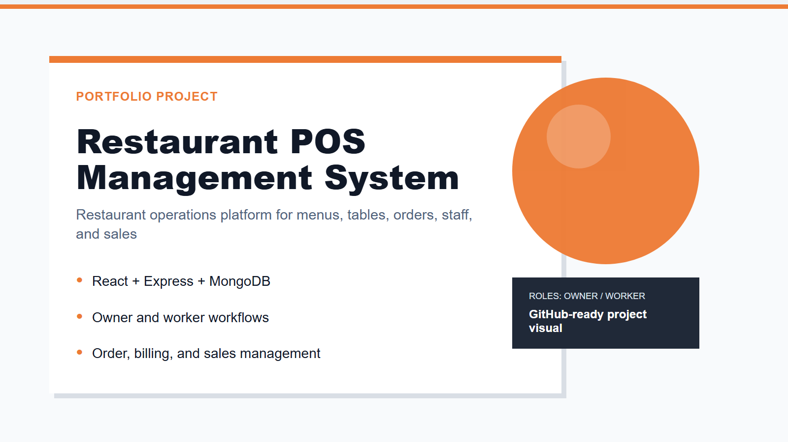

### Runtime pages (captured from the running app)

| Page | Screenshot |
| --- | --- |
| Login | 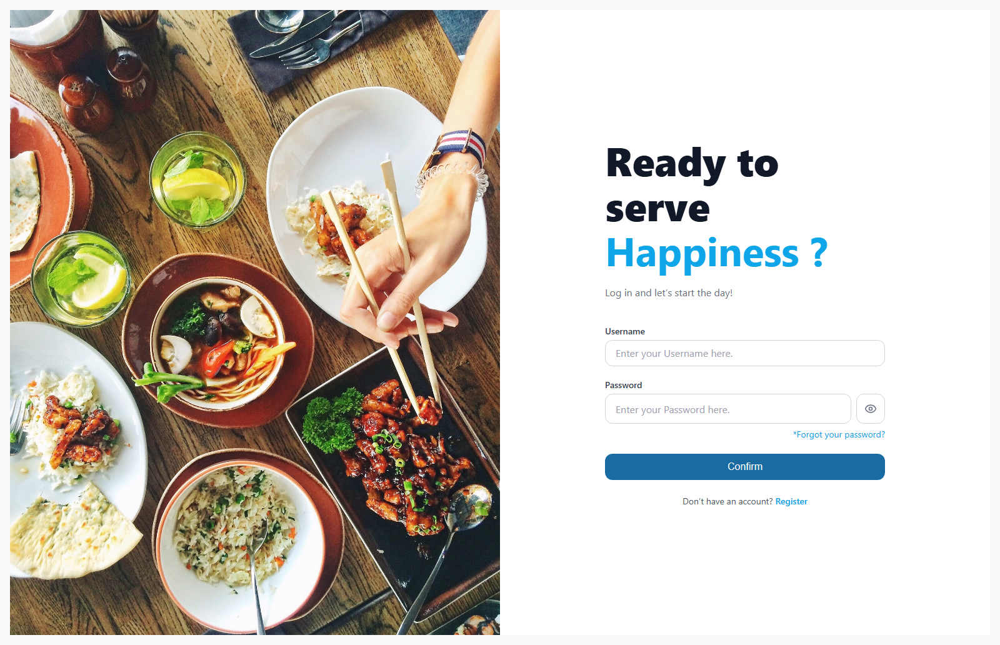 |
| Register | 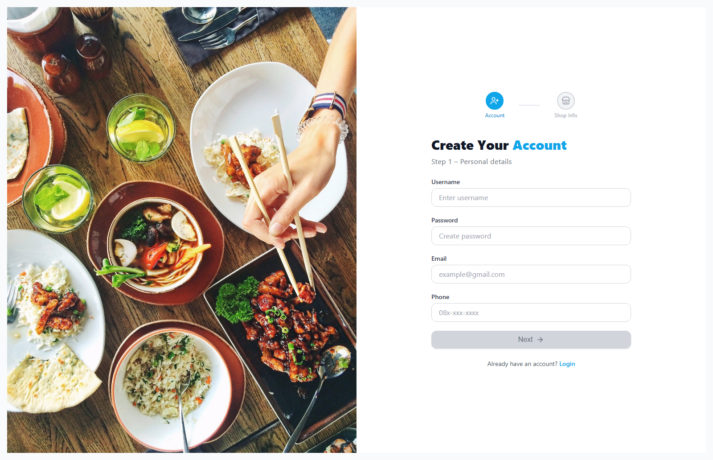 |
| Forgot password | 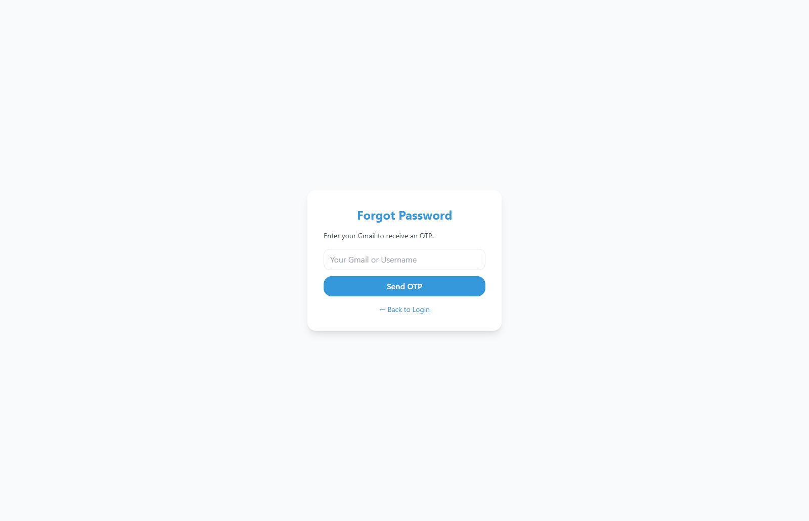 |

### Role-based UI

| Role/page | Preview |
| --- | --- |
| Owner — Dashboard | 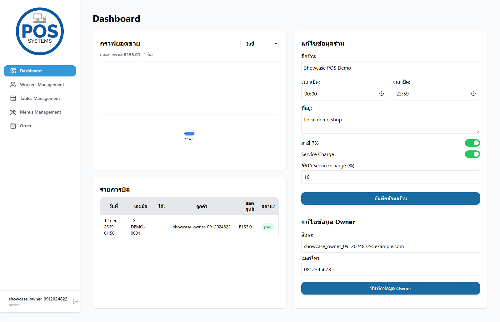 |
| Owner — Workers management | 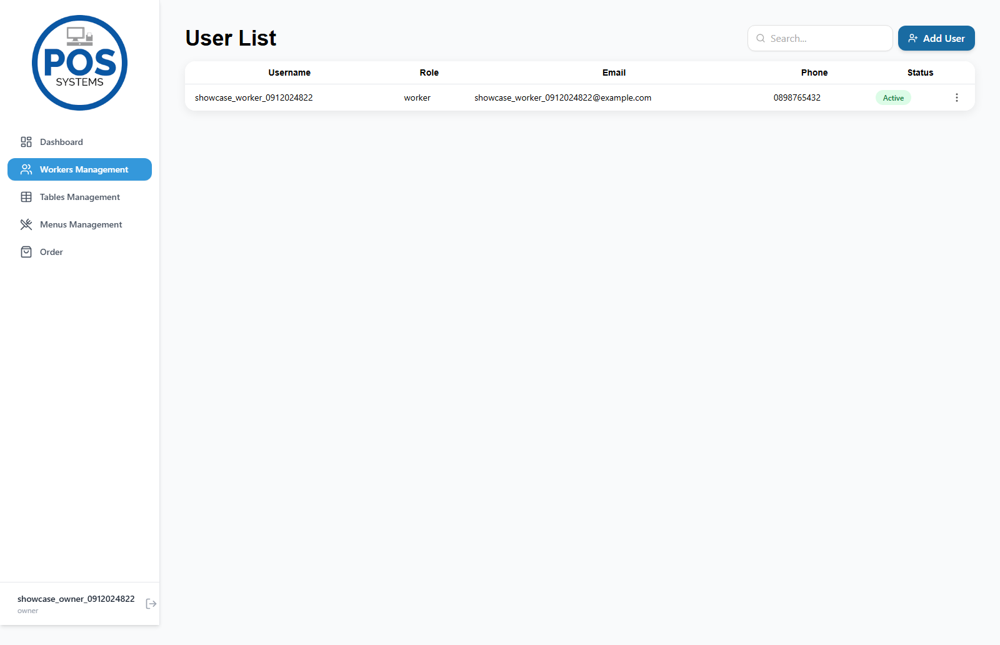 |
| Owner — Tables management | 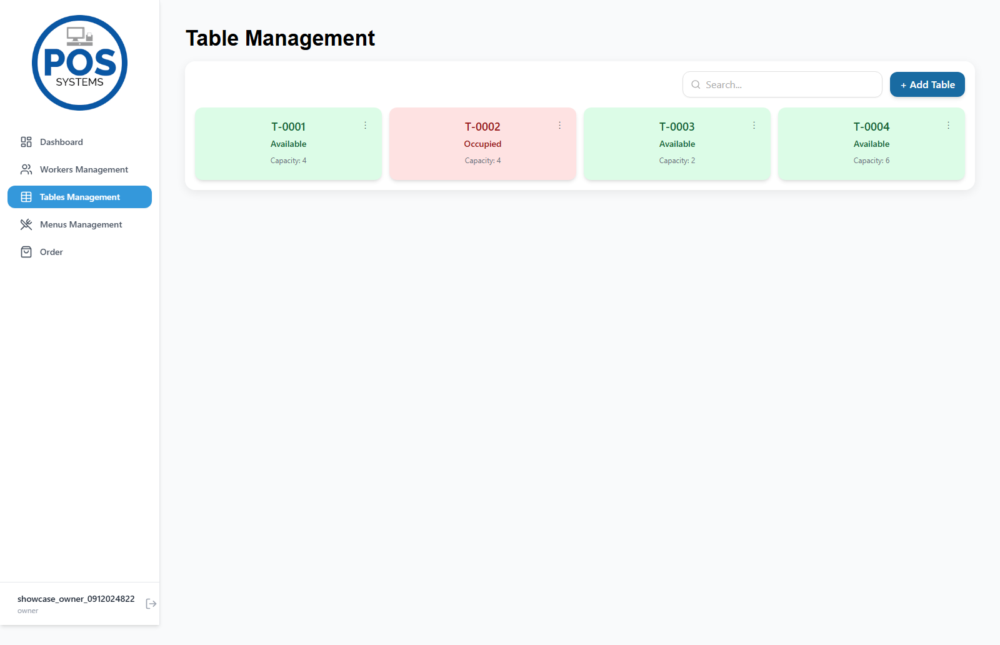 |
| Owner — Menus management | 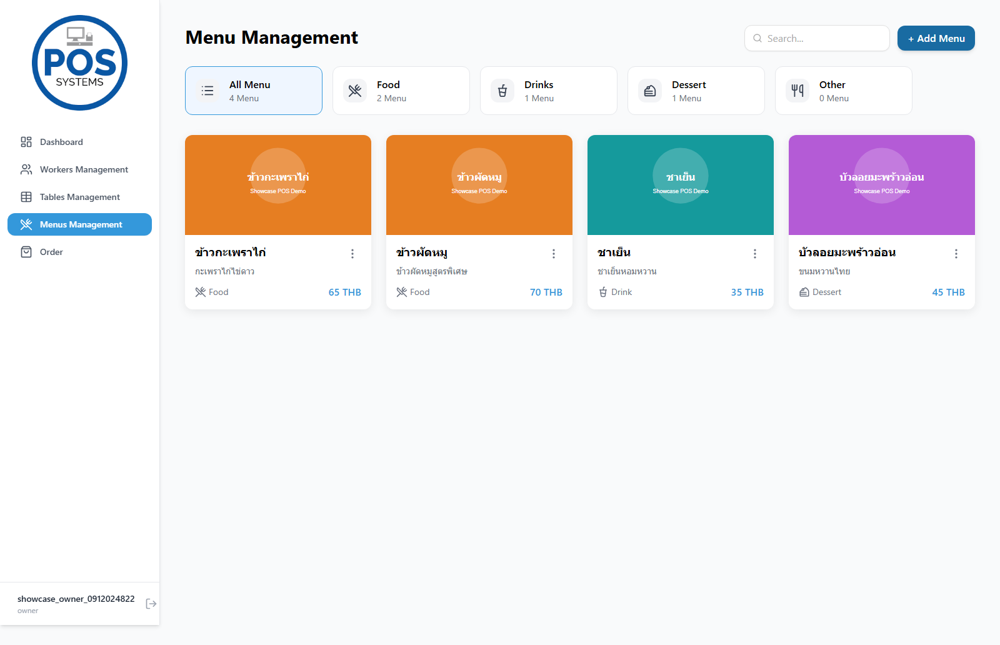 |
| Owner — Order | 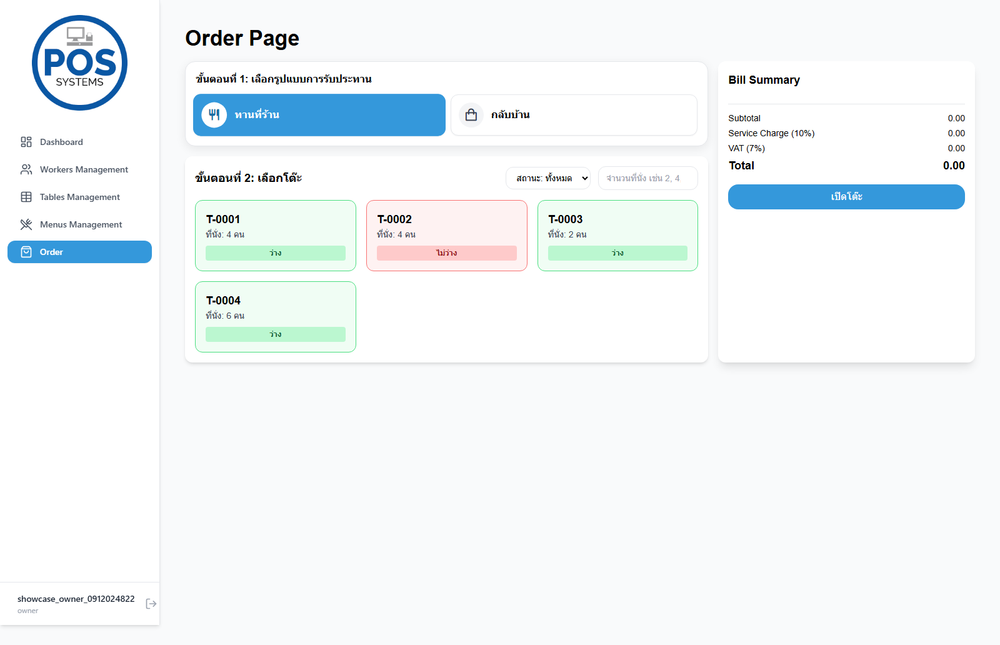 |
| Owner — Order with active table and bill | 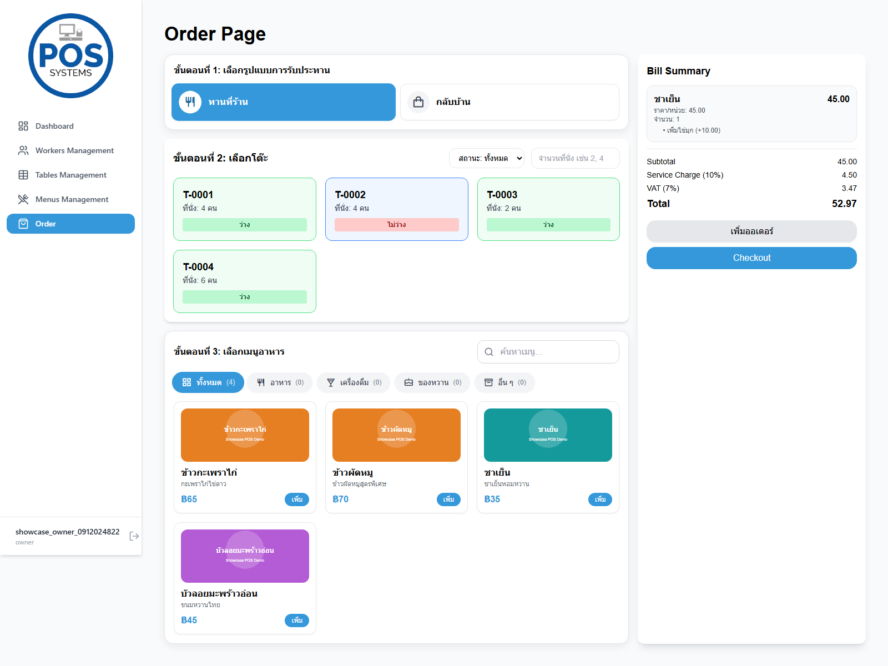 |
| Worker — Order | 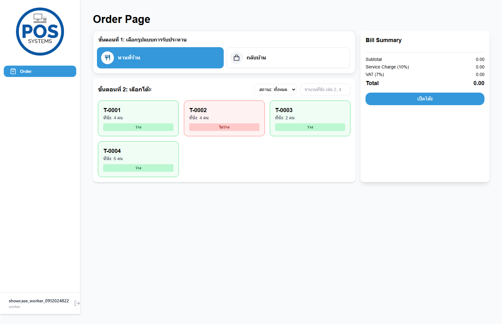 |

The screenshots above were captured against the local Vite frontend and Express API with real MongoDB data. They were checked for visible error alerts, browser page errors, failed requests, and HTTP 5xx responses.

<p align="center">
  
  <br>
  
</p>

## Features

- Login, registration, forgot password, OTP verification, and password reset flows.
- JWT-protected API routes.
- Shop profile and telephone management.
- Menu CRUD with image upload support through Cloudinary utilities.
- Table CRUD and table-based order workflow.
- Order creation, table order update, payment, cancellation, bill retrieval, history, and sales summary.
- User/worker management and owner update routes.
- Swagger UI for backend API documentation.

## Tech Stack

| Layer | Technology |
| --- | --- |
| Frontend | React 19, Vite, React Router, Tailwind CSS, SweetAlert2, lucide-react |
| Backend | Node.js, Express 5, Mongoose, JWT, Socket.IO, Multer, Cloudinary, Swagger |
| Database | MongoDB |

## Project Structure

```text
WebServices-Sun-Pear/
  backend/
    app.js
    server.js
    src/
      controller/
      db/
      middleware/
      model/
      routes/
      utils/
    MongoJson/        # Sample/exported MongoDB JSON data
  frontend/
    src/
```

## Environment Variables

Create `backend/.env` from `backend/.env.example`.

`MONGODB_URI` and `SECRET_KEY` are required for normal operation. `RESEND_API_KEY` is optional for local login/order testing; configure a real Resend key before using the forgot-password email/OTP flow. With the placeholder value, the backend stays available but returns a clear `503` response for that email feature.

## Run Locally

```bash
cd backend
npm install
npm run dev
```

```bash
cd frontend
npm install
npm run dev
```

Default local URLs:

- Frontend: `http://localhost:5173`
- Backend API: `http://localhost:3000`
- Swagger UI: `http://localhost:3000/api-docs`

## API Overview

| Method/Path | Purpose |
| --- | --- |
| `POST /api/auth/login` | Login |
| `POST /api/auth/register` | Register shop/user |
| `POST /api/auth/forgot-password` | Start password reset |
| `POST /api/auth/verify-otp` | Verify OTP |
| `POST /api/auth/reset-password` | Reset password |
| `/api/user` | User/profile/worker management |
| `/api/shop` | Shop profile and telephone data |
| `/api/menu` | Menu CRUD |
| `/api/table` | Table CRUD |
| `/api/order` | Order, payment, cancellation, bill, history, and sales summary |

## Database Schema

See `DATABASE_SCHEMA.md`. The project uses flexible MongoDB collections for `user` and `shop`, and a defined Mongoose schema for `transaction`.

## GitHub Notes

Before publishing, keep `node_modules/`, `.env`, hardcoded MongoDB credentials, and private sample exports out of Git.
